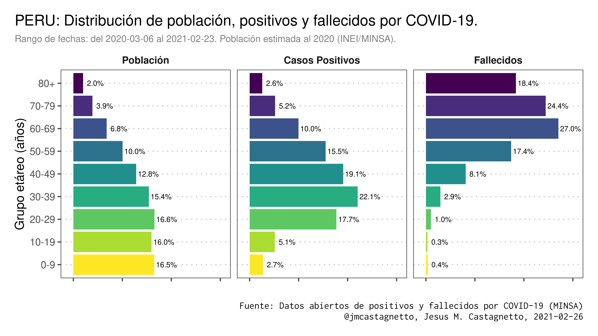
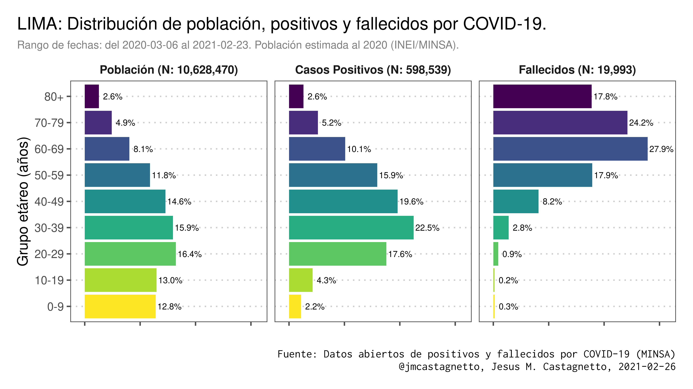
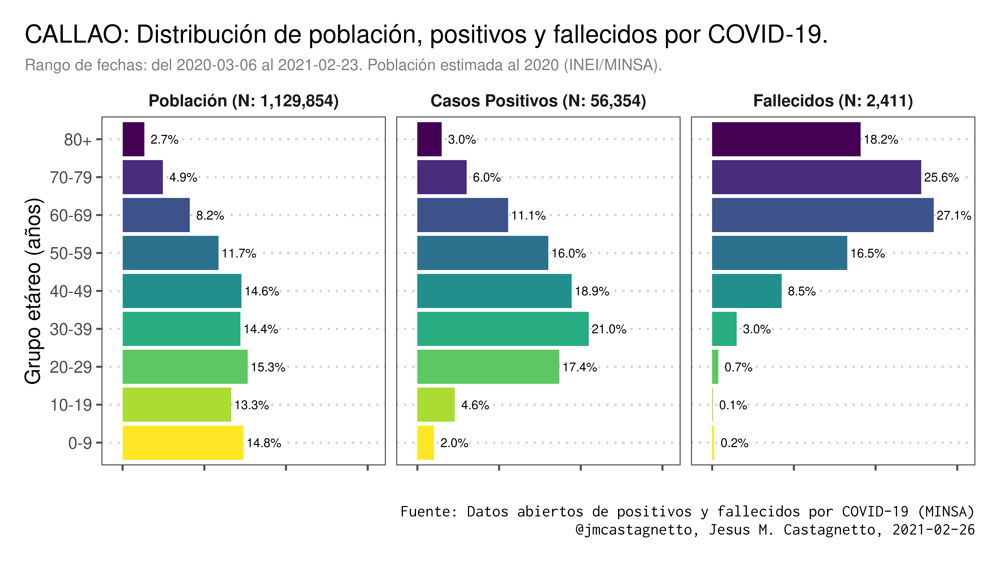

# Gráficos comparativos de distribuciones poblacionales por grupo etáreo,
para todo el Perú y por departamento.

*Datos actualizados al 2020-02-23*

Fuentes originales de datos:

- Población al 2020 (REUNIS, MINSA): https://www.minsa.gob.pe/reunis/data/poblacion_estimada.asp
- Casos positivos por COVID-19 - [Ministerio de Salud - MINSA]: https://www.datosabiertos.gob.pe/dataset/casos-positivos-por-covid-19-ministerio-de-salud-minsa
- Fallecidos por COVID-19 - [Ministerio de Salud - MINSA]: https://www.datosabiertos.gob.pe/dataset/fallecidos-por-covid-19-ministerio-de-salud-minsa

## Ejemplos:

### Perú

### Lima

### Callao

